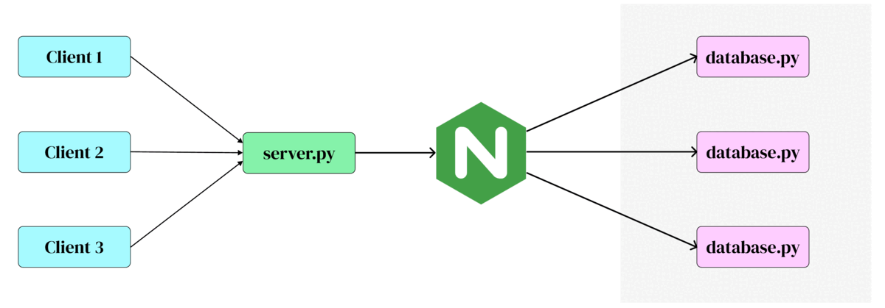

# Job opportunities bot

## Project structure

- ### main server

    The main server _labeled in green in the diagram above_ is responsible for recieving clients requests from telegram. We decided to create this server because it is not possible to retrieve the telegram messages from multiple servers _limitation from telegram_. 

    The server in general is responsible for waiting clients to complete their request. For example, if a client wanted to send a request for posting a job, the server will take the job title, format, type, and requirements. Then, the server will forward this request block to __nginx__.

    The server is only responsilbe for fowarding client requests to nginx. Specifically, It does not send any results to clients. Therefore, it can process a large number of requests and the database manager will send the results to the clients whenever it's ready.

- ### wire

    This python script is create to forward requests from the main server to the nginx server. 

    The functionality of this script is close to RPC (Remote Procedure Call). Basically, it takes the database requests and telegram chat ID and forwards it to the nginx server. 

- ### nginx server

    We decided to make a proxy passer and load balancer with nginx because database operations are much more expensive than waiting for new messages. 
    
    We used nginx official image and with customized nginx configuration file __nginx.conf__.
    Basically, the nginx server forward the incoming requests to three different database managers. Nevertheless, all the managers do post and retrieve operations in the same database.

- ### database managers

    Keep waiting for incoming requests.

    Perform the database requests from clients, and send the result of those requests directly to the client. 

    We decided that database managers directly send the results to clients in order to improve processing speed of server which, in this approach, does not need to wait for the results to be ready in order to send it to the clients.

- ### Docker

    Basically, we have three docker images, an image for nginx, an image for database manager, and an image for server. Each image has all dependencies of the corresponding files.

    We used docker-compose to run the there instances of of database managers in three different containers, as well as nginx container and server container.
     

## Usage

The project uses docker compose to install the requirements, run scripts, and install requirements.

So, to run the project locally you need:

- postgres database

    You need to specify the following in `.env` file:

    - __HOST :__ where the database is hosted
    - __PORT :__ port number for database connection
    - __DB_USER :__ username for the database connection
    - __DB_PASSWORD :__ password to connect
    - __DB_NAME :__ name of the created database

    All of those can be easily created in pg-admin 

- wire connection URL

    __WIRE_URL__: in this project we set it up to be `http://localhost:80` (where nginx is configured to listen).

- docker, docker-compose

    In ubuntu it can be done like in the official [docs](https://docs.docker.com/compose/install/)

- The project is configured to run locally in a single machine using localhost with different port number for each component. If you want to test it on different hosts or maybe on different addresses, here are what you need to change:
    
    - __backend block__ in __nginx.conf__: specify the addresses where you want to run database managers.
    - __listening address__ in __nginx.conf__: specify where you want nginx server to listen and it should be same as __WIRE_URL__ mentioned above.
    - __Addresses where database managers are running__: we spcified them as command line arguments provided to the python file by docker-compose. Therefore, either change them in __docker-compose__ or run __database.py__ with command line argument (port number).

## Testing

Testing in the project is not complete yet. Nevertheless, we have unit testing in `/tests` folder.

To run the tests some more variables need to be set in `.env` file. Those variables are:

- __API_ID :__ it can be found in telegram [apps](https://my.telegram.org/apps)
- __API_HASH :__ it also needed to log in to an account and test the bot. It can also be found in telegram [apps](https://my.telegram.org/apps)
